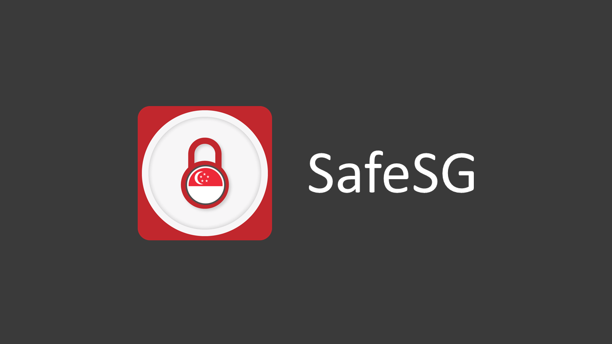
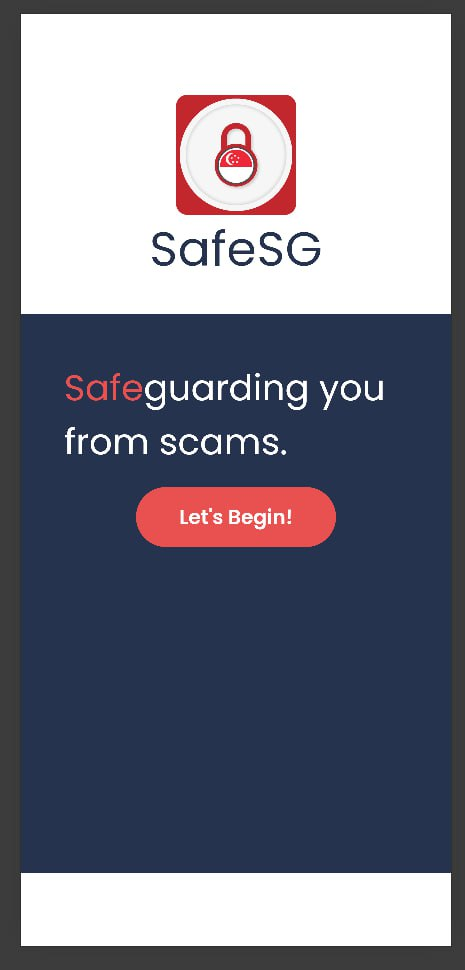
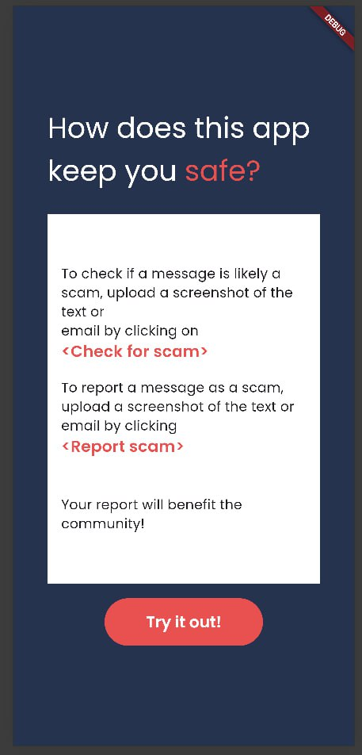
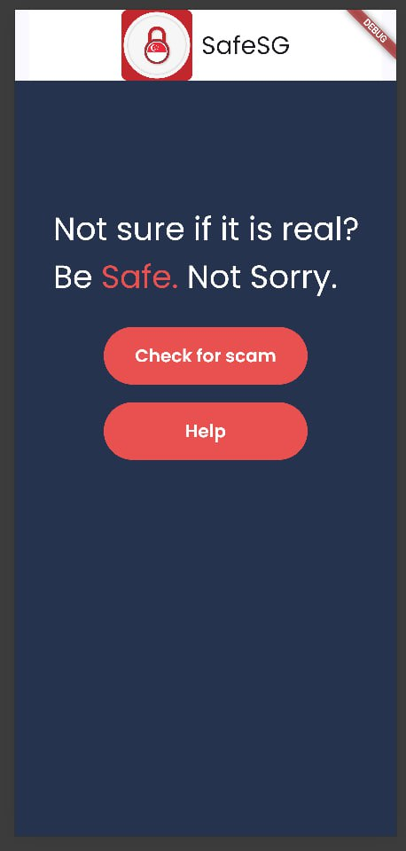
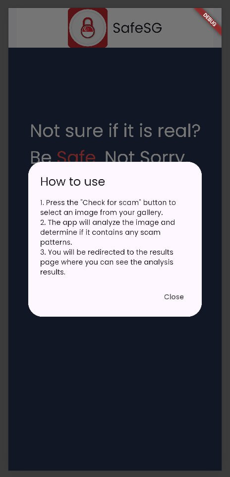
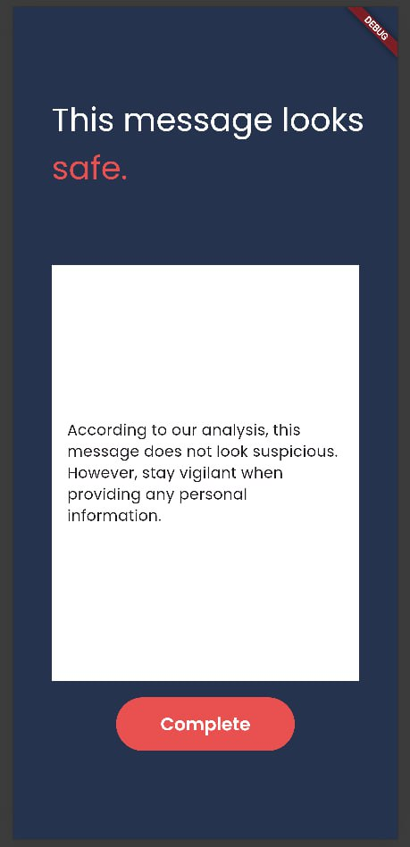
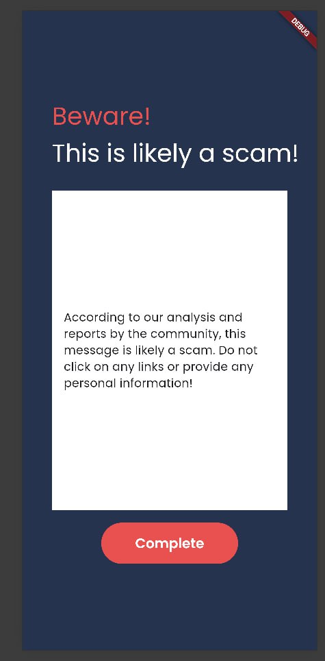

# SafeSG: Your Shield Against Scams



SafeSG is a community-driven platform designed to protect users, especially the elderly, from scammers and phishing attempts. Users can upload screenshots of suspicious calls and emails, and our app will analyze the data using advanced AI techniques such as Language Model Testing (LLM) and Optical Character Recognition (OCR) to identify potential scams. By leveraging community reports and AI-driven validation techniques, SafeSG helps keep users informed and safe, even those with limited technical literacy who are most vulnerable to financial scams such as phishing/smishing. You can read more about our [Business Case](misc/BusinessCase.pdf) here.

## Introduction

SafeSG is developed to combat the rising threat of scams and phishing attempts. With an intuitive interface and powerful backend, SafeSG allows users to quickly and easily report and verify suspicious activities, making it accessible and user-friendly for individuals of all technical backgrounds.

## Features

- **Screenshot Upload:** Users can upload screenshots of incoming calls and emails.
- **Text Extraction:** SafeSG employs advanced Text Extraction techniques, including Language Model Testing (LLM), to extract text from screenshots automatically.
- **Message Analysis:** Utilizing LLM, SafeSG analyzes the extracted text from screenshots to identify potential scam content and phishing attempts.
- **Phone Number Verification:** Extracts phone numbers from screenshots and checks against a database of known scam numbers.
- **Email Validation:** Extracts email addresses from screenshots and verifies their legitimacy by checking against official bank emails and known scam lists.
- **Community Reports:** A crowdsourced database where users can report and share their experiences with scams.
- **Real-Time Alerts:** Receive notifications about new scams reported in your area.
- **Educational Resources:** Access to tips and articles on how to recognize and avoid scams.

## Installation

1. **Clone the Repository:**

   ```sh
   git clone https://github.com/yourusername/SafeSG.git
   cd SafeSG
   ```

## Usage

### Home Screen & Info Page

Welcome to SafeSG! Protect yourself from scams by uploading screenshots of suspicious calls, texts, or emails. Tap "Check for Scam" to get started.

<p align="center">
  
  
</p>

### Upload Screenshots

1. Tap on the "Check for Scam" button.
2. Select a screenshot of an incoming call or email.
3. The app will automatically extract phone numbers or email addresses and the message content.

<p align="center">
  
  
</p>

### Verification

1. The extracted data is checked against our database of known scam numbers and emails.
2. Users receive immediate feedback on whether the number or email is likely to be a scam.

<p align="center">
  
  
</p>

## Coming Soon

### Reporting

1. If you identify a scam, report it to the community through the app.
2. Your report will help others stay informed and avoid similar scams.

### Alerts

Enable notifications to receive real-time alerts about new scams reported in your area.

### Educational Resources

Access a library of articles and tips on how to stay safe from scams.

## Our Team

Welcome to our team page! Meet the talented individuals driving our projects forward:

Low Ye Yang, Caleb [LinkedIn](https://www.linkedin.com/in/caaleb/) | [GitHub](https://github.com/ca-leb)

Gui Ling Ling [LinkedIn](https://www.linkedin.com/in/linglingg/) | [GitHub](https://github.com/ling-ui)

Yap Zher Xiang, Jason [LinkedIn](https://www.linkedin.com/in/ja-sony/) | [GitHub](https://github.com/JasonYapzx/)

Yeo Yu Jie [LinkedIn](https://www.linkedin.com/in/yeoyujie/) | [GitHub](https://github.com/yeoyujie)

Together, we form a dynamic team dedicated to pushing boundaries and delivering exceptional results. Connect with us to learn more about our projects and achievements.
